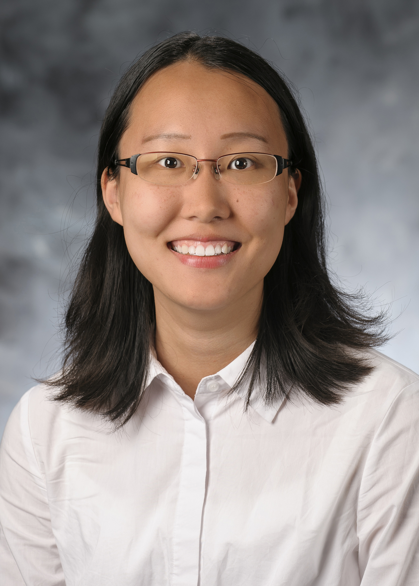

<h2> <a href="{{site.url}}/assets/pdfs/CV_Chen.pdf">CV</a><a href="{{site.url}}/research.html">Research</a><a href="{{site.url}}/teaching.html">Teaching</a></h2>

<!--I am the Weatherall Postdoctoral Fellow at the department of Economics at Queen's University. My primary field of research is <i>Econometrics</i>. Prior to joining Queen's, I received my PhD from the department of Economics at UC San Diego.    
Contact: <b>nkudrin@ucsd.edu</b>-->
  
<!--#-->

<table border="0">
 <tr>
    <td>
      I finished the one-year postdoc at New Mexico Tech in August 2025. My research interests are labor economics, environmental economics, applied econometrics, and accounting. I received my PhD from the Department of Economics at UC Santa Barbara in June 2024. I am an undergraduate alumnus of UC San Diego.  
      I will be on the economics job market in Fall 2025.  
      Contact: <b>yixinchen@ucsb.edu, yixinelainechen@outlook.com</b>
    </td>
   <td></td>
 </tr>
</table>
